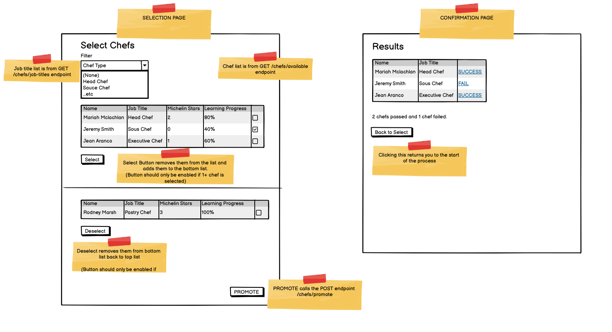

## Chef selector

### Introduction

There are a bunch of chefs in a massive kitchen that are all available to be promoted. You need to write a front end where the Kitchen Manager picks the chefs they think should be put up for the selection process. It will look a little bit like this:

### The basic workflow:

- App loads with Selection Page showing a list of chefs to select (and a filter with job types)
- The user can use check boxes to select a number of chefs (in the top half) and when the click "Select" those chefs will disappear off the top list and be sent to the bottom list
- The user can then potentially change their mind and select chefs in the bottom list and "Deselect" them back into the top list
  NOTE: Selecting and deselecting do not call APIs, the /chefs API call is done at the start of the Select Chef process, and not called again

### The filter

The filter can be used to filter by job title (for ease of the user). Unlike filters we have been using, this is not a server side filter supported by the API, you have to create this filter yourself

### State

This is mainly an exercise in controlling state and also how to filter and map stuff to be how we want it to be. I do not want any context used in this exercise, as there are effectively only 2 pages that can easily have correct state passed between them. This reflects how it what actually be done in real life.

### Tips

1. Start with overall navigation, there is a page for the overall exercise and 2 sub-pages (SelectChefsPage, ResultsPage). I'd build this skeleton first, how does the user for from the selection page to the confirmation page and back (we're not using react router yet)?
2. Next I would build a ChefsTable component that puts a check box next to each chef in a Mui table and has a callback used to communicate who was selected
3. This component could be used for selection and deselection. In fact any answer where it doesn't wouldn't pass ode review

### Promotion

Once the user is happy with their selection (and there is at least one select, promote is pressed, this takes us to the Results Page. I don't think anyone will get there today so lets chat about that on Monday!
