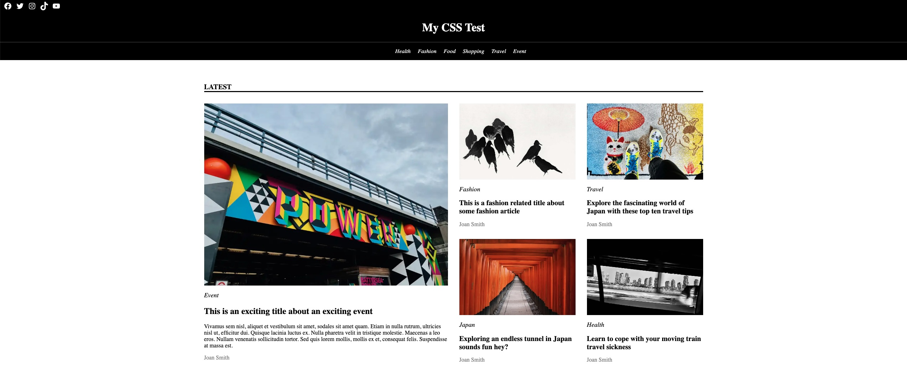

## Welcome to the CSS code test

## Getting started

1. Go into file Explorer and load `index.html` in the Chrome Browser
2. Make it look like this:

Open the image at full size to get an idea (don't use the preview version that is resized)

3. We are using bog standard CSS in one file `styles.css` (already there, already linked) using class names etc. Don't use anything like Styled components, SASS etc this is not a test of that, it's a test of CSS fundamentals...
