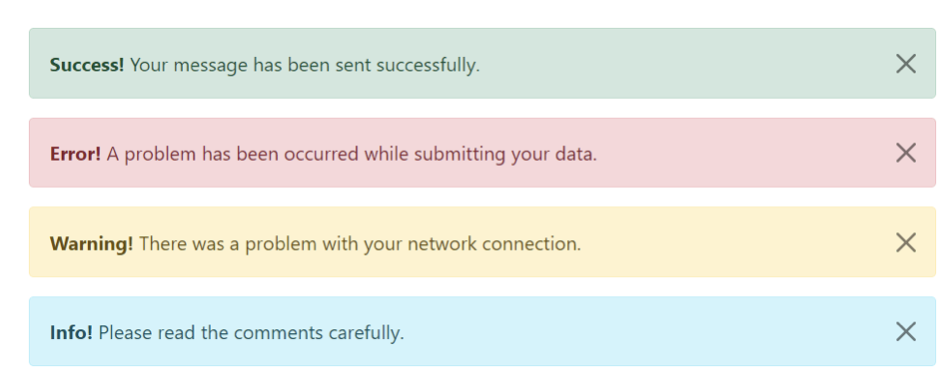

## Create an Alert Type component

It gets passed the following props

- message (string)
- type (can be 'info', 'warning', 'success', 'error')

I would like you to use Styled Props (https://styled-components.com/docs/basics) for the styling.

(This means that the type needs to affect the style)
